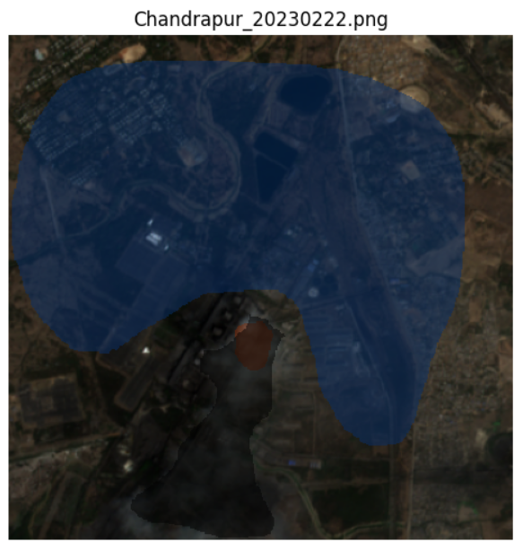

# image_label

manually labeling images for DL model with mouse

Label example see: ***label_eg.ipynb***

How to use:

1. folder structure:

   data\power_plant_name\images **(this image is only used for labeling with only visable bands from S2)**

   data\power_plant_name\raw **(this file is used for training with all bands from S2)**

   
2. run command ***python label.py --path PATH_TO_IMAGE --label LABEL_NAME*** to assign a single label type to each image in the designated folder.
3. left click drag to draw shape to label the interior area with *LABEL_NAME.* The shape will will automatically close upon completion
4. mutiple shapes are allowed for one label in the same image
5. right clikc to remove the previous shape
6. press 'ESC' to save the mask, the masks will be stored individually
7. press 's' to skip current image
8. press 'ENTER' to exit
9. the filename of the rocessed images will be stored in txt files, and they will not be processed again when you re-run the program.

**The response of key input might have some delays.**

Masks:

orange: dense-plume

gray: overall-plume

blue: ground

red: dense-cloud

